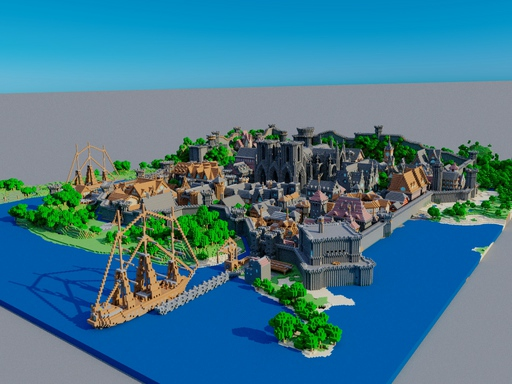
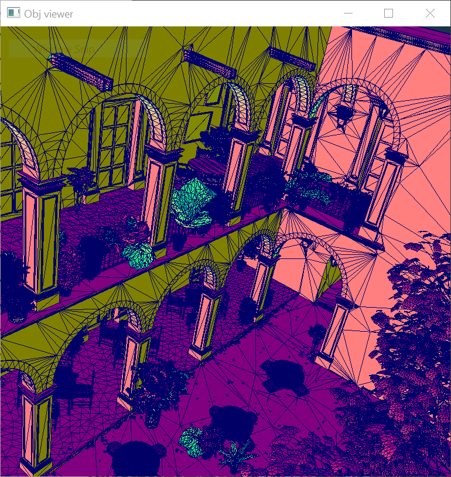

# tinyobjloader

[](https://gitter.im/syoyo/tinyobjloader?utm_source=badge&utm_medium=badge&utm_campaign=pr-badge&utm_content=badge)

[](https://travis-ci.org/syoyo/tinyobjloader)

[](https://app.wercker.com/project/bykey/495a3bac400212cdacdeb4dd9397bf4f)

[](https://ci.appveyor.com/project/syoyo/tinyobjloader/branch/master)

[](https://coveralls.io/github/syoyo/tinyobjloader?branch=master)

http://syoyo.github.io/tinyobjloader/

Tiny but powerful single file wavefront obj loader written in C++. No dependency except for C++ STL. It can parse 10M over polygons with moderate memory and time.

`tinyobjloader` is good for embedding .obj loader to your (global illumination) renderer ;-)

Notice!
-------

We have released new version v1.0.0 on 20 Aug, 2016.
Old version is available `v0.9.x` branch https://github.com/syoyo/tinyobjloader/tree/v0.9.x

## What's new

* 20 Aug, 2016 : Bump version v1.0.0. New data strcutre and API!

### Old version

Previous old version is avaiable in `v0.9.x` branch.

## Example



tinyobjloader can successfully load 6M triangles Rungholt scene.
http://graphics.cs.williams.edu/data/meshes.xml

 

* [examples/viewer/](examples/viewer) OpenGL .obj viewer 

## Use case

TinyObjLoader is successfully used in ...

### New version

* Loading models in Vulkan Tutorial https://vulkan-tutorial.com/Loading_models
* Your project here!

### Old version

* bullet3 https://github.com/erwincoumans/bullet3
* pbrt-v2 https://github.com/mmp/pbrt-v2
* OpenGL game engine development http://swarminglogic.com/jotting/2013_10_gamedev01
* mallie https://lighttransport.github.io/mallie
* IBLBaker (Image Based Lighting Baker). http://www.derkreature.com/iblbaker/
* Stanford CS148 http://web.stanford.edu/class/cs148/assignments/assignment3.pdf
* Awesome Bump http://awesomebump.besaba.com/about/
* sdlgl3-wavefront OpenGL .obj viewer https://github.com/chrisliebert/sdlgl3-wavefront
* pbrt-v3 https://github.com/mmp/pbrt-v3
* cocos2d-x https://github.com/cocos2d/cocos2d-x/
* Android Vulkan demo https://github.com/SaschaWillems/Vulkan
* voxelizer https://github.com/karimnaaji/voxelizer
* Probulator https://github.com/kayru/Probulator
* OptiX Prime baking https://github.com/nvpro-samples/optix_prime_baking
* FireRays SDK https://github.com/GPUOpen-LibrariesAndSDKs/FireRays_SDK
* parg, tiny C library of various graphics utilities and GL demos https://github.com/prideout/parg
* Opengl unit of ChronoEngine https://github.com/projectchrono/chrono-opengl

## Features

* Group(parse multiple group name)
* Vertex
* Texcoord
* Normal
* Material
  * Unknown material attributes are returned as key-value(value is string) map.
* Crease tag('t'). This is OpenSubdiv specific(not in wavefront .obj specification)
* Callback API for custom loading.


## TODO

* [ ] Fix obj_sticker example.
* [ ] More unit test codes.

## License

Licensed under MIT license.

## Usage

`attrib_t` contains single and linear array of vertex data(position, normal and texcoord).
Each `shape_t` does not contain vertex data but contains array index to `attrib_t`.
See `loader_example.cc` for more details.

```c++
#define TINYOBJLOADER_IMPLEMENTATION // define this in only *one* .cc
#include "tiny_obj_loader.h"

std::string inputfile = "cornell_box.obj";
tinyobj::attrib_t attrib;
std::vector<tinyobj::shape_t> shapes;
std::vector<tinyobj::material_t> materials;
  
std::string err;
bool ret = tinyobj::LoadObj(&attrib, &shapes, &materials, &err, inputfile.c_str());
  
if (!err.empty()) { // `err` may contain warning message.
  std::cerr << err << std::endl;
}

if (!ret) {
  exit(1);
}

// Loop over shapes
for (size_t s = 0; s < shapes.size(); s++) {
  // Loop over faces(polygon)
  size_t index_offset = 0;
  for (size_t f = 0; f < shapes[s].mesh.num_face_vertices.size(); f++) {
    int fv = shapes[s].mesh.num_face_vertices[f];

    // Loop over vertices in the face.
    for (size_t v = 0; v < fv; v++) {
      // access to vertex
      tinyobj::index_t idx = shapes[s].mesh.indices[index_offset + v];
      float vx = attrib.vertices[3*idx.vertex_index+0];
      float vy = attrib.vertices[3*idx.vertex_index+1];
      float vz = attrib.vertices[3*idx.vertex_index+2];
      float nx = attrib.normals[3*idx.normal_index+0];
      float ny = attrib.normals[3*idx.normal_index+1];
      float nz = attrib.normals[3*idx.normal_index+2];
      float tx = attrib.texcoords[2*idx.texcoord_index+0];
      float ty = attrib.texcoords[2*idx.texcoord_index+1];
    }
    index_offset += fv;

    // per-face material
    shapes[s].mesh.material_ids[f];
  }
}

```

## Optimized loader

Optimized multi-threaded .obj loader is available at `experimental/` directory.
If you want absolute performance to load .obj data, this optimized loader will fit your purpose.
Note that the optimized loader uses C++11 thread and it does less error checks but may work most .obj data.

Here is some benchmark result. Time are measured on MacBook 12(Early 2016, Core m5 1.2GHz).

* Rungholt scene(6M triangles)
  * old version(v0.9.x): 15500 msecs.
  * baseline(v1.0.x): 6800 msecs(2.3x faster than old version)
  * optimised: 1500 msecs(10x faster than old version, 4.5x faster than basedline)


## Tests

Unit tests are provided in `tests` directory. See `tests/README.md` for details.
